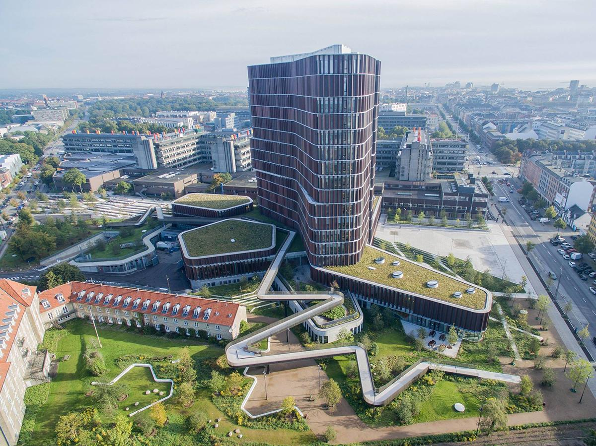

# Overview

*   [Venue](#venue)
*   [Code of conduct](#codeofconduct)

## Venue {#venue}

The conference will be held at 

**The Maersk Tower**  
Blegdamsvej 3B  
2200 Copenhagen N  
Denmark 

Website: <a href="https://maersktower.ku.dk/"> maersktower.ku.dk </a>

<iframe src="https://www.google.com/maps/embed?pb=!1m18!1m12!1m3!1d8996.822798339976!2d12.56338661964933!3d55.6854114273837!2m3!1f0!2f0!3f0!3m2!1i1024!2i768!4f13.1!3m3!1m2!1s0x465253000f237763%3A0x998b21c02de60538!2sM%C3%A6rsk%20T%C3%A5rnet%20-%20K%C3%B8benhavns%20Universitet!5e0!3m2!1sda!2sdk!4v1574510892019!5m2!1sda!2sdk" width="600" height="450" frameborder="0" style="border:0;" allowfullscreen=""></iframe>

## Code of conduct {#codeofconduct}

The organizers of CelbebRation 2020 are dedicated to providing a harassment-free conference experience for everyone regardless of age, gender, sexual orientation, disability, physical appearance, race, or religion (or lack thereof).

All participants (including attendees, speakers, sponsors and volunteers) at CelebRation 2020 are required to agree to the following code of conduct.

The code of conduct applies to all conference activities including talks, panels, workshops, and social events. It extends to conference-specific exchanges on social media, for instance posts tagged with the identifier of the conference (e.g. #CelebRation2020 on Twitter), replies to such posts, and replies to the official social media account (e.g. @CelebRation2020 on Twitter).

Organizers will enforce this code throughout and expect cooperation in ensuring a safe environment for all.

### Expected Behaviour

All conference participants agree to:

- Be considerate in speech and actions, and respect the boundaries of fellow participants.
- Refrain from demeaning, discriminatory, or harassing behaviour and speech. Please refer to Unacceptable Behaviour for more details.
- Alert a member of the code of conduct response team by getting hold of one of the dedicated conference helpers, if you notice someone in distress, or observe violations of this code of conduct, even if they seem inconsequential. Please refer to the section titled What To Do If You Witness or Are Subject To Unacceptable Behaviour for more details.

### Unacceptable Behaviour

Behaviour that is unacceptable includes, but is not limited to:

- Stalking
- Deliberate intimidation
- Unwanted photography or recording
- Sustained or willful disruption of talks or other events
- Use of sexual or discriminatory imagery, comments, or jokes
- Offensive verbal comments related to age, gender, sexual orientation, disability, race or religion
- Inappropriate physical contact, which can include grabbing, or massaging or hugging without consent.
- Unwelcome sexual attention, which can include inappropriate questions of a sexual nature, asking for sexual favours or repeatedly asking for dates or contact information.

If you are asked to stop harassing behaviour you should stop immediately, even if your behaviour was meant to be friendly or a joke, it was clearly not taken that way and for the comfort of all conference attendees you should stop.

Attendees who behave in a manner deemed inappropriate are subject to actions listed under Procedure for Code of Conduct Violations.

### Additional Requirements for Conference Contributions

Presentation slides and posters should not contain offensive or sexualised material. If this material is impossible to avoid given the topic (for example text mining of material from hate sites) the existence of this material should be noted in the abstract and, in the case of oral contributions, at the start of the talk or session.

### Additional Requirements for Sponsors

Sponsors should not use sexualized images, activities, or other material. Booth staff (including volunteers) should not use sexualised clothing/uniforms/costumes, or otherwise create a sexualised environment. In case of violations, sanctions may be applied without return of sponsorship contribution.

### Procedure for Code of Conduct Violations

The organizing committee reserves the right to determine the appropriate response for all code of conduct violations. Potential responses include:

- a formal warning to stop harassing behaviour
- expulsion from the conference
- removal of sponsor displays or conference posters
- cancellation or early termination of talks or other contributions to the program

Refunds may not be given in case of expulsion.

### What To Do If You Witness or Are Subject To Unacceptable Behaviour
You can contact one of the conference helpers, who will be wearing special badges. They will contact the Code of Conduct response team on your behalf and make sure that the situation is handled prompty. You can also contact the code of conduct response team directly at conduct@celebration2020.org if you do not need immediate response.

### Acknowledgements
Parts of the above text are licensed CC BY-SA 4.0. Credit to SRCCON. This code of conduct was based on that developed for useR! 2018 which was a revision of the code of conduct used at previous useR!s and also drew from rOpenSci’s code of conduct.
