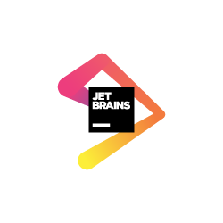

# R conference in Copenhagen, Denmark, February 28-29 2020 celebrating the 20th anniversary of R version v1.0.0

```{r echo=FALSE}

```

**The year 2020 marks the 20th anniversary of the release of R version 1.0.0!**

To celebrate this, we are inviting the community of R users and developers for a two-day celebRation 28-29th February 2020. We kick off on 28th February with hands-on [workshops](workshops.html) on two hot topics, namely data visualization using the ggplot2 package and making fast extensions of R using the rcpp package. The day of the anniversary – February 29 – presents a line-up of speakers who cover the past, the present, and the future of the R programming language. 


<h3>Join the celebRation! <a href="registration.html">Registration is now closed.</a></h3>


<br>

## Sponsors


<div class="row">
  <div class="col-md-6">
<a href="https://www.jetbrains.com/"> <h3>Jet Brains</h3></a>


  </div>
  <div class="col-md-6">
<a href="https://www.novonordisk.com/"> <h3>Novo Nordisk</h3></a>


  </div>
</div>
<div class="row">
  <div class="col-md-6">
<a href = "https://www.dsts.dk"> <h3>The Danish Society for Theoretical Statistics</h3></a>


  </div>
  <div class="col-md-6">
<a href = "https://www.ida.dk"> <h3>The Danish Society of Engineers, IDA</h3></a>


  </div>
</div>

and the **Center for Health Data Science**, University of Copenhagen.


Interested in becoming a sponsor? Have a [look here](sponsorship.html).