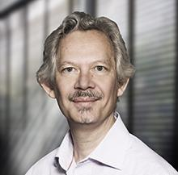
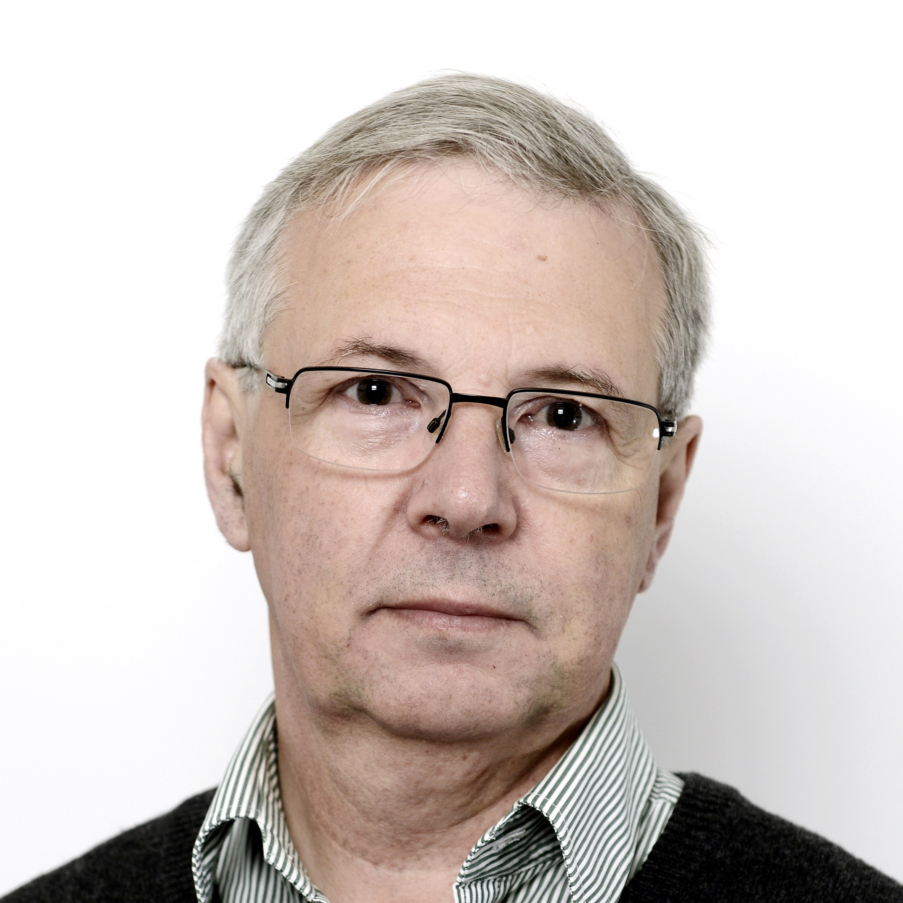
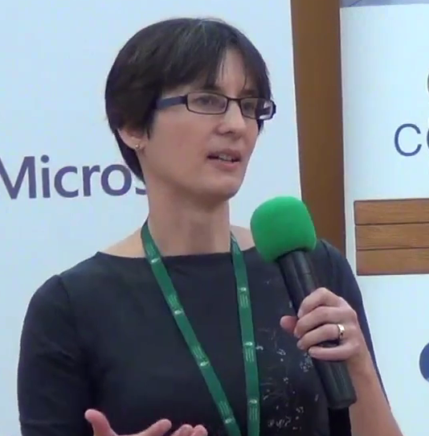
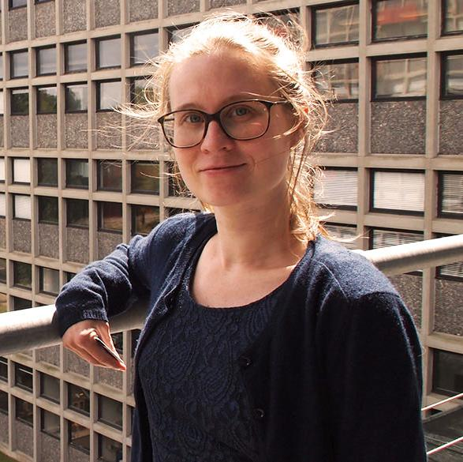
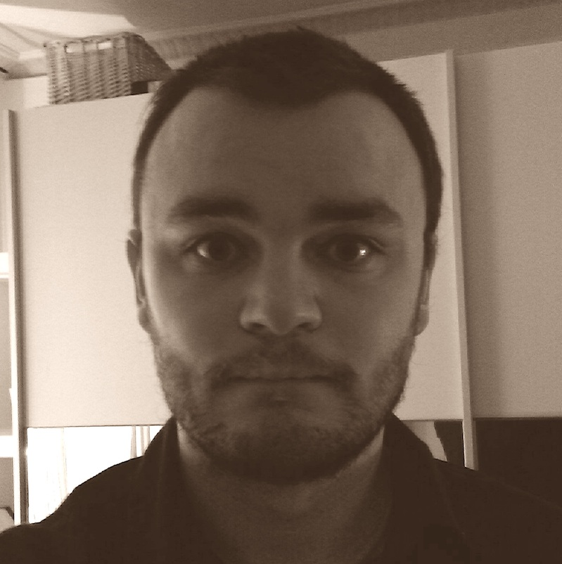
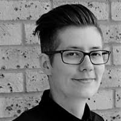
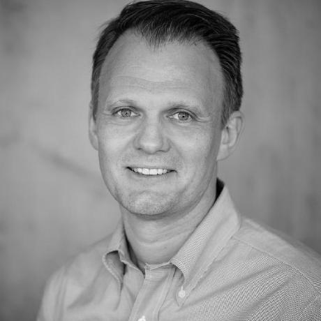
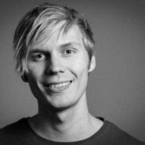

### Program outline
*A detailed program will be added soon.*


##### February 28, 2020:

- 13.00-17.00: [Workshops](workshops.html)

##### February 29, 2020:

- 09.30-18.00: CelebRation 2020 invited presentations, including:
  - Peter Dalgaard: [A Brief History of R and some Thoughts about Its Future]
  - Julia Silge: [Text Mining with Tidy Data Principles]
  - Roger Bivand: [How R Helped Provide Tools for Spatial Data Analysis]
  - Heather Turner: [Moving Forwards: Greater Equity and Inclusion in the R Community]
  - Therese Graversen: TBA
  - Mark Edmondson: [Evolving R with Docker and the Cloud]
  - Hannah Frick: TBA
  
- 18.00-20.00: Reception and celebration of R. 


### Speakers

*More to be announced*

```{r echo=FALSE}
knitr::knit_hooks$set(class = function(before, options, envir) {
  if(before){
    sprintf("<div class = '%s'>", options$class)
  }else{
    "</div>"
  }
})
```


<div class="speakerintro">
```{r echo=FALSE, class="speakerimage"}

```

#### Peter Dalgaard
*Copenhagen Business School, Denmark* 

Peter is a member of the R core group and has been release manager since before the release of version 1.0.0. He is currently working towards the release of version 4.0.0.

</div>


<div class="speakerintro">
```{r echo=FALSE, class="speakerimage"}

```

#### Julia Silge 
*StackOverflow, USA*

Julia is the author of the tidytext R package and has been a strong advocate for tidy structured text mining approaches in R. 

</div>


<div class="speakerintro">
```{r echo=FALSE, class="speakerimage"}

```

#### Roger Bivand 
*Norwegian School of Economics, Norway*

Roger has been active in the R community since 1997 and is the author of numerous R packages, particularly in the field the spatial data analysis. Roger is a member of the R foundation.
</div>


<div class="speakerintro">
```{r echo=FALSE, class="speakerimage"}

```

#### Heather Turner 
*Freelance, UK*

Heather is the chair of R Forwards - an R Foundation task force for underrepresented groups in the R community. Heather is a member of the R foundation. 

</div>

<div class="speakerintro">
```{r echo=FALSE, class="speakerimage"}

```

#### Therese Graversen
*IT University of Copenhagen, Denmark*

Therese has developed the DNAmixtures R package for analyzing DNA samples. She has used her research and the R package to help forensic investigations by serving as an expert witness for the British police several times.

</div>


<div class="speakerintro">
```{r echo=FALSE, class="speakerimage"}

```

#### Mark Edmondson
*IIH Nordic, Denmark*

Mark works as a data engineer at IIH Nordic and is a certified Google Developer Expert for Google Analytics and Google Cloud. He has developed several CRAN packages calling Google APIs such as Google Analytics, Compute Engine and Cloud Storage, some of which he contributes to rOpenSci and the cloudyR organisations.  

</div>


<div class="speakerintro">
```{r echo=FALSE, class="speakerimage"}

```

#### Hannah Frick
*Mango Solutions, UK*

Hannah works as a senior data scientist at Mango Solutions where she helps organisations to become more data-driven through data science projects (with a focus on analytical projects) and training in R and Python. She is a member of the global leadership team of R-Ladies and a co-organiser of the London chapter.

</div>

### Workshop hosts

<div class="speakerintro">
```{r echo=FALSE, class="speakerimage"}

```

#### Dirk Eddelbuettel
*University of Illinois, USA*

Dirk will host a workshop on the Rcpp library, which is a highly used API for integrating C++ code into R.

</div>

<div class="speakerintro">
```{r echo=FALSE, class="speakerimage"}

```

#### Thomas Lin Pedersen
*RStudio, Denmark*

Thomas will host a workshop on the ggplot family of packages can be used for producing diverse and customizable graphics in R. 
</div>


## Abstracts

### A Brief History of R and some Thoughts about Its Future
*Peter Dalgaard*

I will outline the historical context that enabled the creation of R: The PC, Internet, and OpenSource revolution starting around 1990, and the statistical computing environments that were available for young scientists at the time. I will then describe the concrete events leading up to the release of version 1.0.0. I will put some emphasis on the efforts to create a reliable and stable platform for statistical software development. I will also discuss later developments inside and outside the R Core Team and present my views on future challenges.

<br>

### Text Mining with Tidy Data Principles
*Julia Silge*

Today, R users find that text data is increasingly important in many domains in which they work. Tidy data principles and tidy tools can make text mining easier and more effective; in this talk, hear how to manipulate, summarize, and visualize characteristics of text using these methods and R packages from the tidy tool ecosystem. These tools are highly effective for many analytical questions and allow today's R users to integrate natural language processing into effective workflows already in wide use. Explore how to implement approaches from exploratory data analysis to unsupervised and supervised machine learning. 

<br>

### How R Helped Provide Tools for Spatial Data Analysis
*Roger Bivand*

Twenty years ago, most labs and universities had little access to tools for spatial data analysis. The access they had was mostly closed source and costly. We do not know specific adoption rates of open source software for spatial data analysis, nor the shares of R packages. However, the proliferation of reverse depencences on core packages in the Spatial Task View and pagerank analyses do suggest that needs have been met. This gives strong incentives both to maintain backwards compatibility, and to adapt to emerging data sources and methods of analysis. 

<br>

### Moving Forwards: Greater Equity and Inclusion in the R Community
*Heather Turner*

In December 2015, the R Foundation created a taskforce to address the underrepresentation of women among contributors to the R project. Just over a year later, the scope was broadened to include all underrepresented groups and the taskforce took on the name Forwards. The work of Forwards has contributed to the widely-recognised inclusiveness of the R community that has gone from strength to strength in recent years. 

However, there is still much that can be done to widen the participation of underrepresented groups, particularly in the technical side of the R project (developer meetings, package development, R core development), but also in the general user community for specific groups (people living in underserved regions or people with disabilities that affect access). This talk will consider these challenges and discuss some ways we might move forwards to achieve greater equity and inclusion in future.


<br>

### Evolving R with Docker and the Cloud
*Mark Edmondson*

Drawing on the pivotal work of the rocker-project.org, Docker opens up capabilities for R to scale vertically and horizontally within the Cloud. Using Google Cloud Platform as an example, Mark charts his own journey through cloud based R applications, underpinned by embracing Docker. Starting with "lift-and-shift" of replicating local R environments in massive virtual machines, to adapting R workflows to leverage massive parallel processing on computing clusters, and now culminating with his newest ‘serverless R’ package, googleCloudRunner that offers cloud capabilities to anyone with a few lines of R.  Learn how to create R APIs that scale from 0 to millions, throw asynchronous R builds up to the cloud and perform easy script scheduling.
